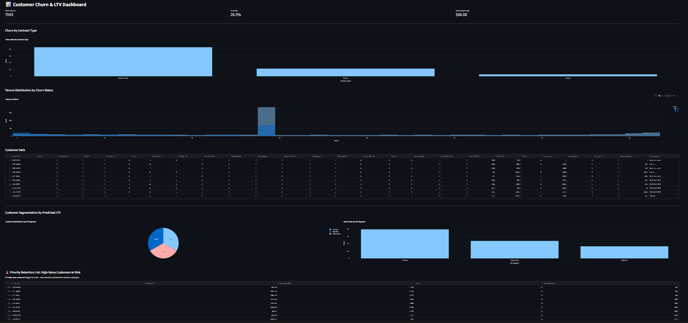

# Customer Churn Prediction & Lifetime Value (LTV) Engine

A predictive analytics system for telecom/subscription businesses that identifies customers at risk of churn and calculates their predicted lifetime value, enabling data-driven retention campaigns.

## Project Overview

This project ingests customer demographic, billing, and service usage data to:
- Predict which customers are likely to churn (classification)
- Estimate each customer's lifetime value (regression)
- Serve both predictions via a REST API
- Visualize churn risk and customer value segments in an interactive dashboard

## Tech Stack

- **Languages**: Python, SQL
- **Data Storage**: PostgreSQL, SQLAlchemy
- **ML & Analysis**: Pandas, Scikit-Learn, XGBoost, SHAP
- **API**: FastAPI
- **Dashboard**: Streamlit, Plotly
- **Deployment**: Docker

## Results

| Model | Accuracy | Precision (Churn) | Recall (Churn) | F1 (Churn) |
|---|---|---|---|---|
| Logistic Regression | 79.5% | 0.64 | 0.52 | 0.57 |
| Random Forest | 78.4% | 0.62 | 0.48 | 0.54 |
| XGBoost | 78.7% | 0.63 | 0.49 | 0.55 |

**Logistic Regression** was selected as the production model based on best overall performance.

LTV Regression Model (Random Forest): **R² = 0.996**, **MAE = $73.05**

## Key Insights (from SHAP analysis)

- `total_services`, `tenure`, and engineered charge-ratio features are the strongest churn predictors
- Month-to-month contract customers churn significantly more than annual/two-year contract customers
- Low-tenure customers are at highest churn risk

## Dashboard



## Project Structure
## How to Run

### 1. Setup
```bash
python -m venv .venv
source .venv/Scripts/activate
pip install -r requirements.txt
```

### 2. Load data into PostgreSQL
```bash
python scripts/load_to_postgres.py
```

### 3. Run the API
```bash
uvicorn api.main:app --reload
```
Visit `http://127.0.0.1:8000/docs` for interactive API documentation.

### 4. Run the Dashboard
```bash
streamlit run dashboard/app.py
```

## API Endpoints

- `POST /predict/single` — Predict churn risk and LTV for one customer
- `POST /predict/batch` — Predict for multiple customers at once

## Data Source

Telco Customer Churn Dataset (IBM), ~7,043 customer records.
